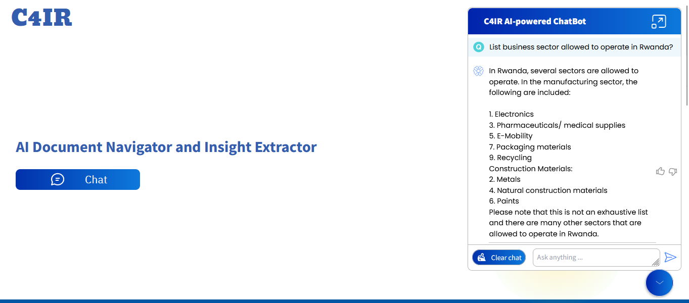

# FRONTEND

This project is an AI-powered tool that helps users navigate and extract insights from documents. It utilizes advanced natural language processing techniques to analyze and interpret the content of documents, enabling users to quickly search for specific information and gain valuable insights.

## Tech Stack

The AI-powered Document Navigator and Insight Extractor is built using the following technologies:

- **Frontend**: React.js, HTML, CSS
- **Backend**: Node.js(16), Express.js, Typescript
- **Database**: MongoDB
- **AI and NLP**: Python(3.10), TensorFlow, Natural Language Toolkit (NLTK), OPENAI API
- **OCR**: Optical Character Recognition API (e.g., Tesseract)

## Installation

To install and run the AI-powered Document Navigator and Insight Extractor locally, follow these steps:

1. Clone the repository from GitHub: `git clone https://github.com/C4IR-Practicum/c4ir_frontend.git`
2. Navigate to the project directory: `cd c4`
3. Install the dependencies: `npm install`
4. Start the development server: `npm start`
5. Open your web browser and visit `http://localhost:3000` to access the application.

#### Note
To ensure that all functions of the system, including the machine learning model that generates responses for user questions, work correctly, you need to add the backend URL as an environment variable. Here's an example of how you can do this:

1. Open the `.env` file in your project directory.
2. Add the following line to the file, replacing `YOUR_ML_URL` with the actual URL of your backend:

` REACT_APP_ML_API_URL='YOUR_ML_URL'
REACT_APP_BACKEND_API_URL='https://c4ir.onrender.com'`

3. Save the `.env` file.
Make sure that your backend is running and accessible at the specified URL. This will ensure that the frontend can communicate with the backend and the machine learning model to provide the desired functionality.

Please note that the exact steps and file names may vary depending on your project setup. Adjust the instructions accordingly based on your specific project structure.

## Dependencies

Here is a list of the dependencies used in this project:

- `@react-oauth/google` - version 0.12.1
- `axios` - version 1.6.0
- `crypto-browserify` - version 3.12.0
- `dotenv` - version 16.3.1
- `gapi-script` - version 1.2.0
- `os-browserify` - version 0.3.0
- `path-browserify` - version 1.0.1
- `react-icons` - version 4.12.0
- `react-loading-skeleton` - version 3.3.1
- `react-toastify` - version 9.1.3
## User Interface

The AI-powered Document Navigator and Insight Extractor provides a user-friendly interface that allows users to interact with the tool effectively. Here are two screenshots showcasing the user interface:

*Caption: Landing page interface with the chatbot on right side.*

*Caption: Visualization of the chat.*
## Conclusion
The AI-powered Document Navigator and Insight Extractor is a powerful tool that leverages AI and NLP techniques to help users navigate and extract valuable insights from documents. By following the installation guide and utilizing the provided dependencies, you can easily set up and run the project on your local machine.

If you have any questions or need further assistance, please don't hesitate to reach out. Enjoy using the AI-powered Document Navigator and Insight Extractor!
